# **ThreadsChatPy: E4 Demonstration of a Programming Paradigm**

Multi-User Command-Line Chat 

## Description
### Problem Context
In today's digital age, communication is crucial, and instant messaging applications are widely used to facilitate this. Applications like WhatsApp, Slack, and Microsoft Teams have become essential tools for personal and professional communication. However, these applications typically run in graphical user interfaces (GUIs). There are scenarios where a simple, lightweight command-line interface (CLI) based chat application is more appropriate. Such scenarios include:

- **Low Resource Environments**: In environments with limited computational resources, a CLI-based chat application consumes significantly less memory and CPU power compared to GUI-based applications.
- **Server Management**: System administrators often work in command-line environments. A CLI-based chat tool can be integrated seamlessly into their workflow, enabling efficient communication without switching contexts.
- **Educational Purposes**: For students and developers learning about concurrent programming, a CLI-based chat application provides a clear and straightforward example of how threading and concurrency can be applied in a practical project.

### Project Description

This project implements a multi-user chat that operates through the command line. The chat application supports multiple users communicating in real-time in a shared chat room. It is built using threads to manage the concurrency required for handling multiple simultaneous user connections and messages.

### Why it is useful

This project is useful for several reasons:

1. **Resource Efficiency**: By running in a command-line environment, the chat application requires minimal system resources, making it suitable for use on older hardware or in systems where performance is a critical concern.
2. **Educational Value**: For students and developers, this project provides practical experience with threading, concurrency, and network programming. It serves as an excellent example of how to handle multiple simultaneous connections and data streams in a real-world application.
3. **Integration with Other CLI Tools**: The chat application can easily be integrated with other command-line tools and workflows, making it a versatile tool for users who prefer or require command-line environments.
4. **Customizability and Extension**: Developers can easily extend the application to add new features or integrate it with other systems, thanks to its straightforward design and implementation.


## **Models**


The solution involves two main components: the server and the client.

1. **Server**: The server is responsible for managing client connections, broadcasting messages to all connected clients, and handling user disconnections.
2. **Client**: Each client connects to the server, sends messages, and receives messages from the server.

The application uses threading to handle multiple clients simultaneously. Each client connection is managed in a separate thread, allowing the server to listen for new connections and broadcast messages concurrently.

#### Diagram

```mermaid
graph TD
    subgraph Cliente
        A1[Inicio Cliente]
        A2[Crear socket y conectarse al servidor]
        A3[Recibir respuesta 'Connected' del servidor]
        A4[Pedir nombre de usuario]
        A5[Enviar nombre de usuario al servidor]
        A6[Crear hilo para recibir mensajes]
        A7[Inicio del hilo de recepción de mensajes]
        A8[Recibir y mostrar mensajes en la GUI]
        A9[Fin del hilo de recepción]
        A10[Inicio de la GUI principal]
        A11[Usuario escribe y envía mensaje]
        A12[Enviar mensaje al servidor]
        A13[Actualizar ventana de chat]
        A14[Cerrar aplicación]
        A15[Fin Cliente]

        A1 --> A2
        A2 --> A3
        A3 --> A4
        A4 --> A5
        A5 --> A6
        A6 --> A7
        A7 --> A8
        A8 --> A8
        A8 -->|Server Disconnected| A14
        A11 --> A12
        A12 --> A13
        A10 --> A11
        A14 --> A15
    end

    subgraph Servidor
        B1[Inicio del Servidor]
        B2[Crear socket y escuchar conexiones]
        B3[Esperar conexiones de clientes]
        B4[Aceptar conexión de cliente]
        B5[Crear hilo para cada cliente]
        B6[Inicio del hilo de cliente]
        B7[Enviar respuesta 'Connected' al cliente]
        B8[Recibir nombre de usuario del cliente]
        B9[Escuchar y retransmitir mensajes]
        B10[Manejar desconexión del cliente]
        B11[Fin del hilo de cliente]
        B12[Fin del Servidor]

        B1 --> B2
        B2 --> B3
        B3 --> B4
        B4 --> B5
        B5 --> B6
        B6 --> B7
        B7 --> B8
        B8 --> B9
        B9 --> B9
        B9 -->|Error| B10
        B10 --> B11
        B3 -->|Keyboard Interrupt| B12
    end

    linkStyle 0 stroke:#f66,stroke-width:2px;
    linkStyle 1 stroke:#f66,stroke-width:2px;
```



## **Implementation**

### Diagram Explanation

#### Client (`hilo_cliente.py`)

1. **Client Start**: The client is initialized.
2. **Create Socket and Connect to Server**: A socket is created and connected to the server at the local IP `127.0.0.1` and port `5000`.
3. **Receive 'Connected' Response from Server**: The client receives an initial response from the server.
4. **Request Username**: The user is prompted to enter their username.
5. **Send Username to Server**: The username is sent to the server.
6. **Create Thread to Receive Messages**: A thread is created to receive messages from the server.
7. **Start Message Reception Thread**: The thread starts receiving messages from the server.
8. **Receive and Display Messages in GUI**: Received messages are displayed in the graphical user interface (GUI).
9. **Server Shutdown**: If the server disconnects, a message is displayed and the application closes.
10. **Start Main GUI**: The main GUI is started.
11. **User Writes and Sends Message**: The user writes and sends a message.
12. **Send Message to Server**: The message is sent to the server.
13. **Update Chat Window**: The chat window is updated with the new message.
14. **Close Application**: The application is closed.
15. **Client End**: End of the client process.

#### Server (`hilo_server.py`)

1. **Server Start**: The server is initialized.
2. **Create Socket and Listen for Connections**: A socket is created and set to listen for connections at the local IP `127.0.0.1` and port `5000`.
3. **Wait for Client Connections**: The server waits for client connections.
4. **Accept Client Connection**: A client connection is accepted.
5. **Create Thread for Each Client**: A separate thread is created to handle each client.
6. **Start Client Thread**: The thread begins execution.
7. **Send 'Connected' Response to Client**: An initial response indicating the client is connected is sent.
8. **Receive Client Username**: The client's username is received.
9. **Listen and Relay Messages**: The server listens to messages from the client and relays them to other clients.
10. **Handle Client Disconnection**: If an error occurs, the client's disconnection is handled.
11. **Client Thread End**: End of the client thread process.
12. **Server End**: End of the server process (due to keyboard interruption).

## **Tests**

To run NombreProyecto on your computer, you first need to have Python installed (https://www.python.org/downloads/). Once Python is installed, you need to download the the file "TestingGrammar.py" or "grammarPynltk" and run with the command:

1. **Start the Server**:
   ```bash
   python threadsServer.py
   ```
   Expected Output:
   ```
   Waiting for connections...
   ```

2. **Start Multiple Clients**:
   ```bash
   python threadsClient.py
   ```
   Follow the prompts to enter a username and send messages.

3. **Test Message Broadcasting**:
   - Client 1 sends a message.
   - Ensure all other clients receive the message.
   - Verify the correct username is displayed with each message.

4. **Test Client Disconnection**:
   - Disconnect a client and ensure the server handles it without crashing.
   - Verify remaining clients can still communicate.

#### Example Tests

**Client 1**:
```
Enter your username: user1
user1: Hello, World!
```

**Client 2**:
```
Enter your username: user2
-> user1: Hello, World!
user2: Hi, user1!
```

**Client 1**:
```
-> user2: Hi, user1!
```


## **Analysis**

#### Alternative Paradigms and Tradeoffs

- **Event-Driven Programming**: Using an event-driven approach (e.g., with async/await) could handle I/O more efficiently and avoid the complexity of managing threads. However, it may introduce complexity in handling state and maintaining readability.
- **Multiprocessing**: Instead of threads, using multiprocessing could avoid some issues related to Python's Global Interpreter Lock (GIL). However, inter-process communication can be more complex and may introduce overhead.
- **Reactive Programming**: Libraries like RxPY could provide a reactive approach to handle streams of messages. This paradigm can be more expressive for certain problems but might require a steep learning curve.

#### Time Complexity

The main operations in the server (accepting connections, broadcasting messages) run in O(n) time complexity, where n is the number of connected clients. This is because broadcasting a message requires sending it to all n clients. The complexity is manageable for a moderate number of clients but may become a bottleneck as the number of clients grows significantly.

## **References**
Intercom (2022). 8 Benefits of Live Chat to Strengthen your Customer Service. Consulted on https://www.intercom.com/learning-center/benefits-of-live-chat
GeeksforGeeks. (2024, May 20). Python Tutorial Learn Python Programming. GeeksforGeeks. https://www.geeksforgeeks.org/python-programming-language/
