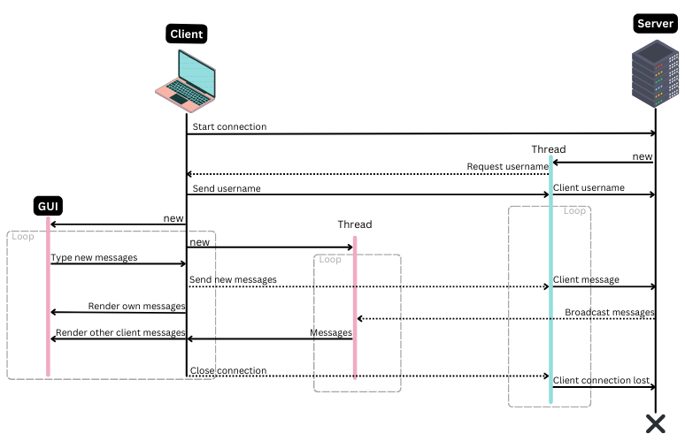
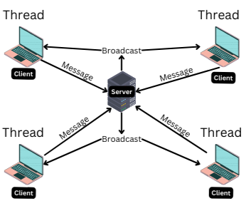
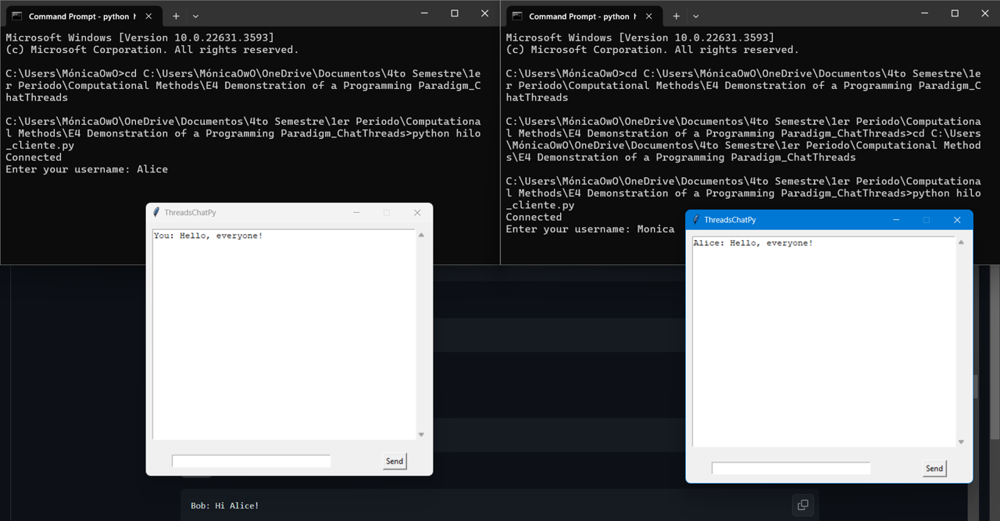
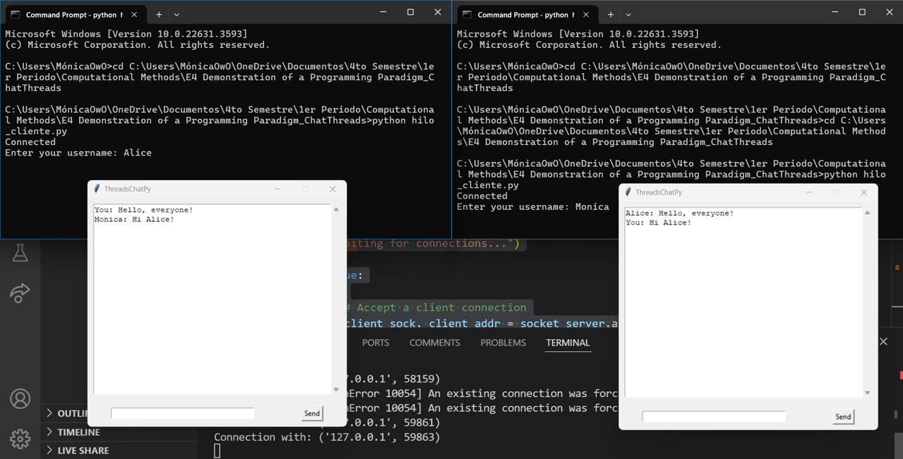
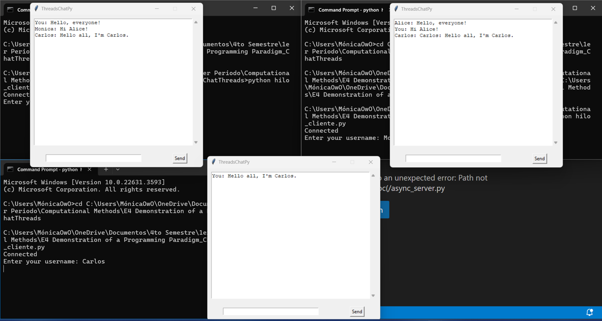
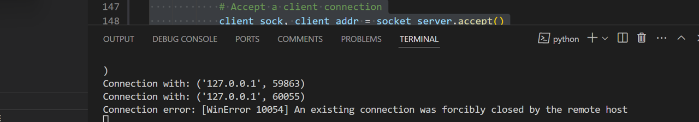

# **ThreadsChatPy: E4 Demonstration of a programming paradigm**

Multi-User chat 

## Description
### Problem context
In today's digital age, communication is crucial, and instant messaging applications are widely used to facilitate this. Applications like "WhatsApp", "Slack", and "Microsoft Teams" have become essential tools for personal and professional communication. 

Live chat is a real-time messaging platform that enables direct communication between customers and businesses via websites or apps. It offers uninterrupted 24/7 support, leveraging automation and AI to provide immediate responses, capture customer needs, and direct queries efficiently. Proactive assistance is a key feature, enabling businesses to engage customers with targeted messages and support across multiple channels, ensuring a good experience. Live chat facilitates personalized, conversational interactions, enhancing customer connection and satisfaction. Automation helps manage support at scale, optimizing resource allocation and providing contextual insights into customer queries. By streamlining processes and enabling multitasking, live chat enhances productivity for support teams while delivering superior customer experiences compared to traditional communication methods like phone calls or emails. Therefore, implementing a Python project with a simple chat feature was the best choice as it aligns with the benefits and functionalities of live chat, offering efficient and effective support solutions in the current landscape (Intercom, 2022).

However, these applications typically run in graphical user interfaces (GUIs). There are scenarios where a simple, lightweight command-line interface (CLI) based chat application is more appropriate. Such scenarios include:

- **Low Resource Environments**: In environments with limited computational resources, a CLI-based chat application consumes significantly less memory and CPU power compared to GUI-based applications.
- **Server Management**: System administrators often work in command-line environments. A CLI-based chat tool can be integrated seamlessly into their workflow, enabling efficient communication without switching contexts.
- **Educational Purposes**: For students and developers learning about concurrent programming, a CLI-based chat application provides a clear and straightforward example of how threading and concurrency can be applied in a practical project.

This project implements a multi-user chat that operates through the command line. The chat application supports multiple users communicating in real-time in a shared chat room. It is built using threads to manage the concurrency required for handling multiple simultaneous user connections and messages.

### Why it is useful

This project is useful for several reasons:

1. **Resource Efficiency**: By running in a command-line environment, the chat application requires minimal system resources, making it suitable for use on older hardware or in systems where performance is a critical concern.
2. **Educational Value**: For students and developers, this project provides practical experience with threading, concurrency, and network programming. It serves as an excellent example of how to handle multiple simultaneous connections and data streams in a real-world application.
3. **Integration with Other CLI Tools**: The chat application can easily be integrated with other command-line tools and workflows, making it a versatile tool for users who prefer or require command-line environments.
4. **Customizability and Extension**: Developers can easily extend the application to add new features or integrate it with other systems, thanks to its straightforward design and implementation.

## **Models and implementation**

The solution involves two main components: the server and the client.

1. **Server**: The server is responsible for managing client connections, broadcasting messages to all connected clients, and handling user disconnections.
2. **Client**: Each client connects to the server, sends messages, and receives messages from the server.

The application uses threading to handle multiple clients simultaneously. Each client connection is managed in a separate thread, allowing the server to listen for new connections and broadcast messages concurrently.

#### Diagram

```mermaid
graph TD
    subgraph Cliente
        A1[Inicio Cliente]
        A2[Crear socket y conectarse al servidor]
        A3[Recibir respuesta 'Connected' del servidor]
        A4[Pedir nombre de usuario]
        A5[Enviar nombre de usuario al servidor]
        A6[Crear hilo para recibir mensajes]
        A7[Inicio del hilo de recepción de mensajes]
        A8[Recibir y mostrar mensajes en la GUI]
        A9[Fin del hilo de recepción]
        A10[Inicio de la GUI principal]
        A11[Usuario escribe y envía mensaje]
        A12[Enviar mensaje al servidor]
        A13[Actualizar ventana de chat]
        A14[Cerrar aplicación]
        A15[Fin Cliente]

        A1 --> A2
        A2 --> A3
        A3 --> A4
        A4 --> A5
        A5 --> A6
        A6 --> A7
        A7 --> A8
        A8 --> A8
        A8 -->|Server Disconnected| A14
        A11 --> A12
        A12 --> A13
        A10 --> A11
        A14 --> A15
    end

    subgraph Servidor
        B1[Inicio del Servidor]
        B2[Crear socket y escuchar conexiones]
        B3[Esperar conexiones de clientes]
        B4[Aceptar conexión de cliente]
        B5[Crear hilo para cada cliente]
        B6[Inicio del hilo de cliente]
        B7[Enviar respuesta 'Connected' al cliente]
        B8[Recibir nombre de usuario del cliente]
        B9[Escuchar y retransmitir mensajes]
        B10[Manejar desconexión del cliente]
        B11[Fin del hilo de cliente]
        B12[Fin del Servidor]

        B1 --> B2
        B2 --> B3
        B3 --> B4
        B4 --> B5
        B5 --> B6
        B6 --> B7
        B7 --> B8
        B8 --> B9
        B9 --> B9
        B9 -->|Error| B10
        B10 --> B11
        B3 -->|Keyboard Interrupt| B12
    end

    linkStyle 0 stroke:#f66,stroke-width:2px;
    linkStyle 1 stroke:#f66,stroke-width:2px;
```



### Communication diagrams



The presented model illustrates the interaction flow between clients and the server in a multi-user chat application implemented using threads. The chat application facilitates real-time communication between multiple clients connected to a central server.

To implement this, we will utilize Python's robust support for multithreading, a crucial aspect in network programming for concurrent communication between multiple clients and a server. Python's simplicity and readability facilitate rapid development and maintenance, while its extensive libraries and frameworks simplify the implementation of complex functionalities like multithreading. By leveraging Python's multithreaded architecture, we ensure efficient real-time messaging and seamless interaction within the chat application, ultimately enhancing user experience and satisfaction. This approach allows the server to handle multiple client connections concurrently, enhancing scalability and responsiveness, with each client connection managed in a separate thread. This multithreaded design fosters simultaneous communication without blocking other clients, fostering efficient real-time messaging and ensuring smooth interaction within the chat application (GeeksforGeeks, 2024).

#### Client interaction flow:

1. **Start client**:
   The client application starts execution.

2. **Create socket and connect to server**:
   The client creates a socket to establish a connection with the server using the specified IP address and port.

3. **Receive connected response from server**:
   Upon successful connection, the client receives a connected acknowledgment from the server, indicating a successful connection establishment.

4. **Request username**:
   The client prompts the user to input their desired username.

5. **Send username to server**:
   The client sends the chosen username to the server for identification purposes.

6. **Create thread for receiving messages**:
   The client creates a separate thread to continuously listen for incoming messages from the server while allowing the main thread to handle user interactions and GUI updates concurrently.

7. **Start message reception thread**:
   The message reception thread starts execution, waiting for messages from the server.

8. **Receive and display messages in GUI**:
   Upon receiving a message from the server, the message reception thread updates the graphical user interface (GUI) to display the received message to the user.

9. **End of message reception thread**:
   The message reception thread terminates execution either when the server disconnects or when the client closes the application.

10. **Start main GUI**:
    The main graphical user interface (GUI) of the client application starts, allowing the user to interact with the chat interface.

11. **User writes and sends message**:
    The user interacts with the chat interface, composing a message to send to other users in the chat room.

12. **Send message to server**:
    The client sends the composed message to the server for distribution to other connected clients.

13. **Update chat window**:
    The client updates the chat window in the GUI to display the sent message.

14. **Close application**:
    The user chooses to exit the application, closing the chat client.

15. **End client**

#### Server interaction flow:

1. **Start server**:
   The server application starts execution.

2. **Create socket and listen for connections**:
   The server creates a socket and binds it to a specified IP address and port, enabling it to listen for incoming client connections.

3. **Wait for client connections**:
   The server enters a loop to continuously wait for incoming connection requests from clients.

4. **Accept client connection**:
   Upon receiving a connection request, the server accepts the connection, creating a new socket dedicated to communication with the client.

5. **Create thread for each client**:
   The server spawns a new thread to handle communication with the connected client, allowing the main server thread to continue accepting new connections.

6. **Start client thread**:
   The client thread starts execution, managing communication with the connected client.

7. **Receive username from client**:
   The server receives the username sent by the client for identification purposes.

8. **Listen and relay messages**:
   The server continuously listens for incoming messages from the client and relays them to other connected clients.

9. **Handle client disconnection**:
   The server handles any disconnection events from the client, cleaning up resources and terminating the client thread if necessary.

10. **End of client thread**:
    The client thread terminates execution either upon client disconnection or upon server shutdown.

11. **End server**:
    The server application terminates execution, ending the chat service.

The model is grounded in the principles of concurrent programming and network communication. It incorporates concepts from computer networking, such as socket programming, as well as concurrent execution using threads.
- Socket programming and network communication (Python, R., 2023) (Tanenbaum, A. S., & Wetherall, D. J. , 2011)
- Parallel programming with threads (Andrews, G. R, 1999) (Bellairs, 2019)

The multithreaded architecture enables parallel execution of communication tasks, allowing the server to handle multiple client connections concurrently. This approach enhances scalability and responsiveness of the chat application, ensuring smooth communication even with a large number of connected clients. The flow of interactions between clients and the server follows a well-defined sequence of steps, ensuring proper communication and synchronization between different components of the system. The use of separate threads for handling client connections and message reception allows for efficient utilization of system resources and minimizes blocking, thereby enhancing the overall performance of the chat application.

## **Tests**

To run ThreadsChatPy on your computer, you first need to have Python installed (https://www.python.org/downloads/). Once Python is installed, you need to download the the file "hilo_Client.py" or "hilo_Server.py" and once you are in the folder you put both file, you run in the terminal of Visual Studio the following command:

1. **Start the server**:
   ```bash
   python hilo_Server.py
   ```
   Expected Output:
   ```
   Waiting for connections...
   ```
This will create the server of the chat. Now to prove the functionality of the solution, you need to start the multiple clients using different commands prompts using this command: 
*Note:* Remember you need to be in the folder you have both project files -> cd *Path to the correct folder* 

2. **Start multiple clients**:
   ```bash
   python hilo_Client.py
   ```
   Follow the prompts to enter a username and send messages.

### Message tests

**Test 1: User `Alice` sends a message**

You need to type next to username "Alice", then in the interface GUI you need to write the message "Hello, everyone!"

- **`Alice`'s interface**:
  ```md
  Connected
  Enter your username: Alice
  ```
  
- **`Alice`'s interface**:

  ```md
  You: Hello, everyone!
  ```

This is how the others clients see your message:

- **`Monica`'s interface**:
  ```md
  Alice: Hello, everyone!
  ```



#### Test 2: User `Monica` responds

To reply "Alice", then in the interface GUI, you need to write the message "Hi Alice!"

- **`Monica`'s interface**:
  ```md
  You: Hi Alice!
  ```

This is how the others clients see your message:
- **`Alice`'s interface**:
  ```md
  Monica: Hi Alice!
  ```



#### Test 3: User `Carlos` joins and sends a message

You need to open a new command prompt (to do it see the previous steps), then type next to username "Carlos", then in the interface GUI you need to write the message "Hello all, I'm Carlos"

- **`Carlos`'s interface**:
  ```md
  You: Hello all, I'm Carlos.
  ```
This is how the others clients see your message:

- **`Alice`'s interface**:
  ```md
  Monica: Hi Alice!
  Carlos: Hello all, I'm Carlos.
  ```

- **`Monica`'s interface**:
  ```md
  Alice: Hello, everyone!
  Carlos: Hello all, I'm Carlos.
  ```



#### Test 4: User `Alice` disconnects

- **`Server`'s interface (after handling the disconnection)**:
  ```md
  Connection error: [WinError 10054] An existing connection was forcibly closed by the remote host
  ```



Every time you enter your username in the command prompt interface, the chat interface in question will appear on your screen, allowing you to start using the chat's functionalities. You can simulate "being different clients" to test if the chats update accordingly, just like in a live chat.

The expected behavior is that each client's chat interface updates with the respective client and message that was sent. Due to the use of threads, the response time should be fast and almost immediate, maintaining the live chat experience. With the various command prompts and UTF-8 support, you can even use emojis! So, just have fun!

## **Analysis**

#### 1. **Asynchronous programming**

Uses `asyncio` and `await` to handle I/O operations asynchronously within a single thread. Instead of creating a new thread for each connection, coroutines are used to handle multiple connections concurrently.

**Advantages**:
- **Lower resource usage**: Avoids the overhead of creating and managing multiple threads.
- **Efficiency**: Handles many concurrent connections efficiently without blocking the main thread.
- **Simplicity**: The code can be easier to follow since it does not directly manage multiple threads and their synchronization.

**Disadvantages**:
- **Initial complexity**: It can be more difficult to understand and set up initially if you are not familiar with `asyncio`.
- **Compatibility**: Not all Python libraries are compatible with `asyncio`, which can limit options.
- **GIL limitations**: In Python, the Global Interpreter Lock (GIL) remains a limitation for CPU-bound tasks, though this is less relevant for I/O tasks.

**Example**:
```python
import asyncio
import tkinter as tk
from tkinter import scrolledtext

async def handle_messages(reader):
    while True:
        message = await reader.read(1024)
        if not message:
            break
        chat_window.config(state=tk.NORMAL)
        chat_window.insert(tk.END, message.decode() + '\n')
        chat_window.config(state=tk.DISABLED)
        chat_window.yview(tk.END)

async def send_messages(writer):
    while True:
        message = await loop.run_in_executor(None, message_entry.get)
        if message:
            writer.write(message.encode())
            await writer.drain()
            chat_window.config(state=tk.NORMAL)
            chat_window.insert(tk.END, "You: " + message + '\n')
            chat_window.config(state=tk.DISABLED)
            chat_window.yview(tk.END)
            message_entry.delete(0, tk.END)

async def main():
    reader, writer = await asyncio.open_connection('127.0.0.1', 5000)
    await writer.write(user_name.encode())

    loop.create_task(handle_messages(reader))
    await send_messages(writer)

loop = asyncio.get_event_loop()
loop.run_until_complete(main())
```

#### 2. **Event-Driven programming**
Uses an event-driven approach where network events are handled through callbacks (e.g., using libraries like Twisted in Python).

**Advantages**:
- **High concurrency**: Similar to `asyncio`, it can efficiently handle many simultaneous connections.
- **Modularity**: The code can be more modular and decoupled.

**Disadvantages**:
- **Debugging complexity**: Can be more difficult to debug and maintain due to extensive use of callbacks.
- **Learning curve**: May have a steeper learning curve if you are not familiar with the event-driven paradigm.

**Example**:
```python
from twisted.internet import protocol, reactor
from twisted.protocols.basic import LineReceiver

class ChatServer(LineReceiver):
    def __init__(self):
        self.clients = []

    def connectionMade(self):
        self.clients.append(self)
        self.sendLine(b'Connected')

    def lineReceived(self, line):
        for client in self.clients:
            if client != self:
                client.sendLine(line)

class ChatFactory(protocol.Factory):
    def buildProtocol(self, addr):
        return ChatServer()

reactor.listenTCP(5000, ChatFactory())
reactor.run()
```

#### 3. **Processes instead of threads**
Uses processes instead of threads to handle concurrency, utilizing Python's `multiprocessing` library.

**Advantages**:
- **No GIL**: Each process has its own Python interpreter, avoiding GIL limitations, ideal for CPU-bound tasks.
- **Isolation**: Processes are more isolated from each other, which can increase program stability.

**Disadvantages**:
- **Higher resource usage**: Creating and managing multiple processes is more costly in terms of memory and system resources compared to threads.
- **More complex communication**: Inter-process communication (IPC) is more complex and slower than communication between threads.

**Example**:
```python
from multiprocessing import Process, Pipe
import socket

def handle_client(conn, pipe):
    conn.send(b'Connected')
    while True:
        message = conn.recv(1024)
        if not message:
            break
        pipe.send(message)
        response = pipe.recv()
        conn.send(response)
    conn.close()

def main():
    server_socket = socket.socket(socket.AF_INET, socket.SOCK_STREAM)
    server_socket.bind(('127.0.0.1', 5000))
    server_socket.listen(5)

    while True:
        client_conn, addr = server_socket.accept()
        parent_pipe, child_pipe = Pipe()
        process = Process(target=handle_client, args=(client_conn, child_pipe))
        process.start()

        while True:
            message = parent_pipe.recv()
            parent_pipe.send(message)

if __name__ == '__main__':
    main()
```

### Paradigm Comparison

| Paradigm                   | Advantages                                                             | Disadvantages                                                             |
|----------------------------|------------------------------------------------------------------------|---------------------------------------------------------------------------|
| **Thread-Based Programming** | Easy to understand and use.                                            | Higher memory and resource usage. Synchronization issues and GIL.        |
| **Asynchronous Programming** | Efficient for I/O operations. Lower resource usage.                   | Initial complexity and learning curve. GIL limitations.                   |
| **Event-Driven Programming** | High concurrency and modularity.                                       | Difficult to debug and maintain. Steeper learning curve.                  |
| **Processes Instead of Threads** | No GIL limitations. Process isolation.                                | Higher resource usage. More complex and slower inter-process communication.|

To address the problem, the only viable methods are using threads or event-driven programming, as we need to perform tasks simultaneously, utilizing multiprocessing or some form of parallel processing. For true parallel processing, multithreading allows tasks to be executed on different processor cores. In asynchronous programming (async), functions are implemented in an interleaved or concurrent manner, whereas with threading, tasks are executed in parallel (GeeksforGeeks, 2024). Both have a complexity of O(n), so I decided to choose the one that was easier for me to implement. That would be threads, as I found their implementation more straightforward based on my general knowledge.

### Time Complexity

When I first created the code to make this chat functional, the time complexity of the code was O(n). This is because the while loop would not be considered O(n) since it is only waiting for new messages to be sent, unlike the for loop.

However, this while loop is indefinite as it listens to a socket, meaning it will never terminate. Therefore, the complexity of this algorithm would actually be defined by loops that do terminate, such as the for loop.

The main operations in the server run in O(n) time complexity, where n is the number of connected clients. This is because broadcasting a message requires sending it to all n clients. The complexity is manageable for a moderate number of clients but may become a bottleneck as the number of clients grows significantly.

**Connection handling (serverConnection Function)**

   - **socket_server.accept()**: O(1) - Accepting a new connection is a constant-time operation.
   - **client_dic[client_adrr] = ...**: O(1) - Adding a new client to the dictionary is a constant-time operation.
   - **threading.Thread(target=comCliente, args=(client_adrr,)).start()**: O(1) - Starting a new thread is a constant-time operation.

   The overall time complexity for handling each new connection is O(1).

**Client communication handling (comCliente Function)**

   - **client_dic[client_adrr]['Socket'].send(...)**: O(1) - Sending a message to the client is a constant-time operation.
   - **userClient(client_adrr)**: O(1) - Receiving the username is considered a constant-time operation.
   - **client_dic[username]['Socket'].recv(1024).decode()**: O(1) - Receiving a message from the client is a constant-time operation, assuming the message size is bounded by a constant.
   - **broadcastMessage(username, message)**: O(n) - Broadcasting a message to all other clients involves iterating over the client dictionary and sending the message, where n is the number of clients.

   The overall time complexity for handling each message from a client is O(n).

**Broadcasting messages (broadcastMessage Function)**

   - **for client in client_dic**: O(n) - Iterating over all clients.
   - **client_dic[client]['Socket'].send(...)**: O(1) - Sending a message to each client is a constant-time operation.

   The overall time complexity for broadcasting a message is O(n).

**Deleting a client (deleteClient Function)**

   - **for client in client_dic**: O(n) - Iterating over all clients to find the one to delete.
   - **client_dic.pop(username)**: O(1) - Removing a client from the dictionary is a constant-time operation.

   The overall time complexity for deleting a client is O(n).

*Summary of time complexities*
- Accepting a new connection: O(1)
- Handling a client message: O(n)
- Broadcasting a message: O(n)
- Deleting a client: O(n)


## **References**
Intercom (2022). 8 Benefits of Live Chat to Strengthen your Customer Service. Consulted on https://www.intercom.com/learning-center/benefits-of-live-chat
GeeksforGeeks. (2024, May 20). Python Tutorial Learn Python Programming. GeeksforGeeks. https://www.geeksforgeeks.org/python-programming-language/
GeeksforGeeks. (2024, February 26). Thread in operating system. GeeksforGeeks. https://www.geeksforgeeks.org/thread-in-operating-system/
Andrews, G. R. (1999). Concurrent Programming: Principles and Practice. Addison-Wesley.
Tanenbaum, A. S., & Wetherall, D. J. (2011). Computer Networks (5th Edition). Pearson.
Python, R. (2023, November 16). Socket programming in Python (Guide). https://realpython.com/python-sockets/
Bellairs, R. (2019, April 10). What is parallel programming and multithreading? Perforce Software. https://www.perforce.com/blog/qac/multithreading-parallel-programming-c-cpp

